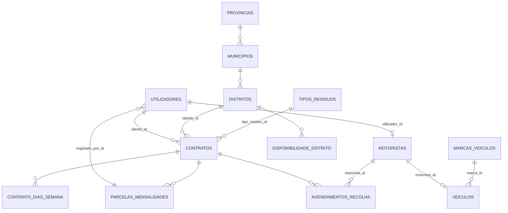

# ELISAL-EP — Tecnologias e Modelagem de Dados

Sistema web de gestão da recolha de resíduos sólidos urbanos para a ELISAL-EP (Luanda).
Trabalho de Fim de Curso — UnIA — Engenharia Informática (autor: Simão Graça Lima).

Backend + Frontend no mesmo repositório: o backend vive na raiz e o frontend em `frontend/`.

---

## 1. Stack geral

| Camada | Tecnologia | Versão * |
|---|---|---|
| Backend (API) | PHP + Laravel | PHP ^8.3 · Laravel ^13.8 |
| Autenticação | Laravel Sanctum (tokens pessoais) | ^4.3 |
| Frontend | React + TypeScript | React ^19.2 · TS ~6.0 |
| Build / dev server | Vite + plugin React | ^8.2 |
| UI | MUI (Material UI) | ^9.3 |
| Formulários | React Hook Form + Zod + `@hookform/resolvers` | ^7.85 / ^4.4 / ^5.7 |
| HTTP | Axios | ^1.19 |
| Rotas | React Router DOM | ^7.18 |
| Base de dados | MySQL 8.4 (dev/prod) · SQLite `:memory:` (testes) | — |
| PDF (recibos) | barryvdh/laravel-dompdf | ^3.1 |
| Filas | Driver `database` (sem Redis) | — |

\* Versões conforme `composer.json` / `frontend/package.json`.

---

## 2. Backend (Laravel)

- **API REST JSON** sob `/api`, protegida por Sanctum (Bearer token).
- **RBAC** via middleware de papel (`role:admin|cliente|motorista`) — nunca confiando só no frontend.
- **Regras de negócio** em serviços dedicados em `app/Services/` (Sem controllers gordos):
  - `ContratoPricingService` — precificação (valor mensal / total / taxa de adesão).
  - `ContratoClienteService` — abertura de contratos + validação de disponibilidade.
  - `GerarParcelasService`, `GerarAgendamentoService` — parcelas mensais e agenda (chamada síncrona).
  - `ParcelaLiquidacaoService` — liquidação de parcelas (transacção, recibo auto/manual).
  - `AnularContratoService`, `ReagendarAgendamentoService`, `AtribuirMotoristaService`.
  - `MotoristaCronogramaService`, `ConcluirRecolhaService`, `CancelarRecolhaService`.
  - `AdminAgendamentoService` + helper `IntervaloDatas`.
- **Nomeação**: domínio em português (`estado`, `taxa_adesao`, `distrito_id`); código em inglês.
- **Testes**: PHPUnit (`phpunit.xml`), SQLite em memória, `composer test` ≡ `config:clear` + `php artisan test`.
- **Formatação**: Laravel Pint.
- **Outros**: Laravel Tinker, Laravel Pail (logs em tempo real), collisions da `nunomaduro`.

---

## 3. Frontend (React + Vite)

- **Estrutura**: `src/pages/{admin,cliente,motorista}`, `src/layouts`, `src/components`, `src/api`, `src/types`, `src/context`.
- **Autenticação**: `AuthContext` + token em `localStorage`; guardas `RequireAuth` / `RequireRole`; `roleHomePath` por papel.
- **Formulários**: React Hook Form + `zodResolver` (schemas zod em PT, mensagens em PT).
- **UI**: MUI v9 — tema ELISAL em `src/theme` (verdes corporativos), layouts distintos por papel:
  - Admin: drawer lateral; Cliente: área pessoal; Motorista: **design mobile-first** (bottom nav).
  - Landing page pública em `/` com referências do site oficial (www.elisal.ao).
- **Login separado**: `/login` (selecção de perfil) → `/login/cliente` e `/login/funcionario`.
- **Tipos partilhados**: `src/types` espelham a API (Portuguese field names).
- **Qualidade**: `tsc -b` (typecheck) + ESLint integrados no `npm run build`.

---

## 4. Modelagem da base de dados

Base MySQL **3FN**, designação em português. Campos `created_at`/`updated_at` (timestamps Laravel)
omissos na listagem abaixo por compactação.

### 4.1 Tabelas

#### `utilizadores`
| Campo | Tipo | Notas |
|---|---|---|
| id | bigint PK | |
| nome | string | |
| email | string UNIQUE | |
| password | string | |
| role | enum | `admin`, `cliente`, `motorista` (default cliente) |
| tipo_cliente | enum | `particular`, `empresa` (default particular) |
| nif | string NULL | |
| telefone | string | |
| endereco_principal | string NULL | adicionado em migração |
| bloqueado / motivo_bloqueio | bool / string NULL | controlo de acesso do cliente |
| email_verified_at | timestamp NULL | |
| remember_token | string NULL | |

#### `provincias` → `municipios` → `distritos`
Geografia em 3 níveis, unicidade por pai:
- `provincias(id, nome UNIQUE)`
- `municipios(id, provincia_id FK→provincias, nome; UNIQUE(provincia_id, nome))`
- `distritos(id, municipio_id FK→municipios, nome; UNIQUE(municipio_id, nome))`

#### `disponibilidade_distrito`
| Campo | Tipo | Notas |
|---|---|---|
| id | bigint PK | |
| distrito_id | bigint FK→distritos (cascade) | |
| dia_semana | tinyint unsigned | 1–7, CHECK; UNIQUE(distrito_id, dia_semana) |

#### `tipos_residuos`
| Campo | Tipo | Notas |
|---|---|---|
| id | bigint PK | |
| nome | string UNIQUE | |
| descricao | text | |
| preco_unitario_recolha | decimal(10,2) unsigned | |
| taxa_adesao | decimal(10,2) unsigned default 0 | CHECK ≥ 0 |

#### `contratos`
| Campo | Tipo | Notas |
|---|---|---|
| id | bigint PK | |
| cliente_id | bigint FK→utilizadores (cascade) | |
| distrito_id | bigint FK→distritos (restrict) | |
| tipo_residuo_id | bigint FK→tipos_residuos (restrict) | |
| taxa_adesao | decimal(10,2) unsigned | |
| valor_mensal | decimal(10,2) unsigned | |
| valor_total | decimal(10,2) unsigned | |
| frequencia_semanal | smallint unsigned | CHECK > 0 |
| duracao_meses | smallint unsigned | CHECK > 0 |
| estado | enum | `pendente`, `aprovado`, `rejeitado`, `cancelado` |
| rua / ponto_referencia | string NULL | |
| latitude / longitude | string NULL | |

#### `contrato_dias_semana`
| Campo | Tipo | Notas |
|---|---|---|
| id | bigint PK | |
| contrato_id | bigint FK→contratos (cascade) | |
| dia_semana | tinyint unsigned | 1–7, CHECK; UNIQUE(contrato_id, dia_semana) |

#### `motoristas`
| Campo | Tipo | Notas |
|---|---|---|
| id | bigint PK | |
| utilizador_id | bigint FK→utilizadores (cascade), UNIQUE | |
| numero_carta | string | (sem matrícula — movida para `veiculos`) |

#### `marcas_veiculos`
| Campo | Tipo | Notas |
|---|---|---|
| id | bigint PK | |
| nome | string UNIQUE | seed: Toyota, Chevrolet, Mitsubishi, Nissan, Hyundai |

#### `veiculos`
| Campo | Tipo | Notas |
|---|---|---|
| id | bigint PK | |
| matricula | string UNIQUE | |
| marca_id | bigint FK→marcas_veiculos (null) | |
| modelo | string NULL | |
| motorista_id | bigint FK→motoristas (null on delete) | |

#### `parcelas_mensalidades`
| Campo | Tipo | Notas |
|---|---|---|
| id | bigint PK | |
| contrato_id | bigint FK→contratos (cascade) | |
| numero_parcela | int unsigned | UNIQUE(contrato_id, numero_parcela) |
| valor | decimal(10,2) unsigned | |
| data_vencimento | date | vencimento dia 5 |
| estado | enum | `pendente`, `pago`, `cancelado` |
| data_pagamento | date NULL | |
| numero_recibo | string NULL | auto `REC-{contrato:pad4}-{parcela}` ou manual |
| registado_por_id | bigint FK→utilizadores NULL | admin que liquidou |

#### `agendamentos_recolha`
| Campo | Tipo | Notas |
|---|---|---|
| id | bigint PK | |
| contrato_id | bigint FK→contratos (cascade) | |
| motorista_id | bigint FK→motoristas NULL | null = sem motorista |
| data_recolha | datetime | índice (data_recolha, estado) |
| data_recolha_anterior | datetime NULL | histórico de reagendamento |
| reagendado_por_id | bigint FK→utilizadores NULL | |
| observacao | text NULL | obrigatória no cancelamento |
| estado | enum | `pendente`, `concluido`, `cancelado` |

### 4.2 Diagrama ER (Mermaid)

### 4.3 Relacionamentos principais

- `contratos` N:1 `utilizadores` (cliente) · N:1 `distritos` · N:1 `tipos_residuos`.
- `contratos` 1:N `contrato_dias_semana` · 1:N `parcelas_mensalidades` · 1:N `agendamentos_recolha`.
- `motoristas` 1:1 `utilizadores` · `veiculos` 0..1:1 `motoristas` · N:1 `marcas_veiculos`.
- `agendamentos_recolha` N:1 `motoristas` (nula) — atribuição feita pelo admin após a geração.
- Regras transversais implementadas em SQL (MySQL) e/ou serviços: CHECK de `dia_semana` 1–7,
  CHECK de valores monetários ≥ 0, unicidades por chave composta (3FN).

---

## 5. Comandos úteis

- `composer test` — testes PHPUnit (SQLite em memória).
- `composer dev` — serve, queue worker, pail e Vite em conjunto.
- `composer setup` — instalação completa (deps, `.env`, key, migrate, build).
- `npm run build` — typecheck + build de produção do frontend.
- `./vendor/bin/pint` — formatação Laravel.